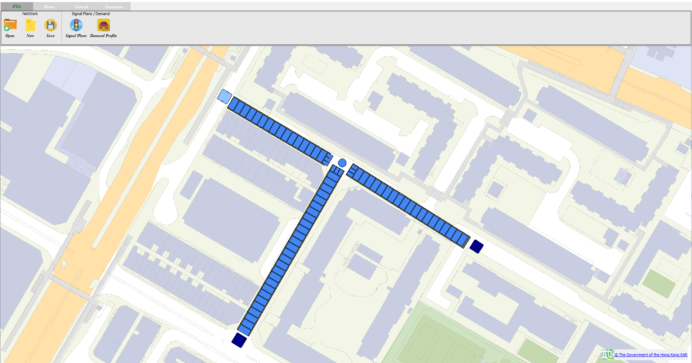
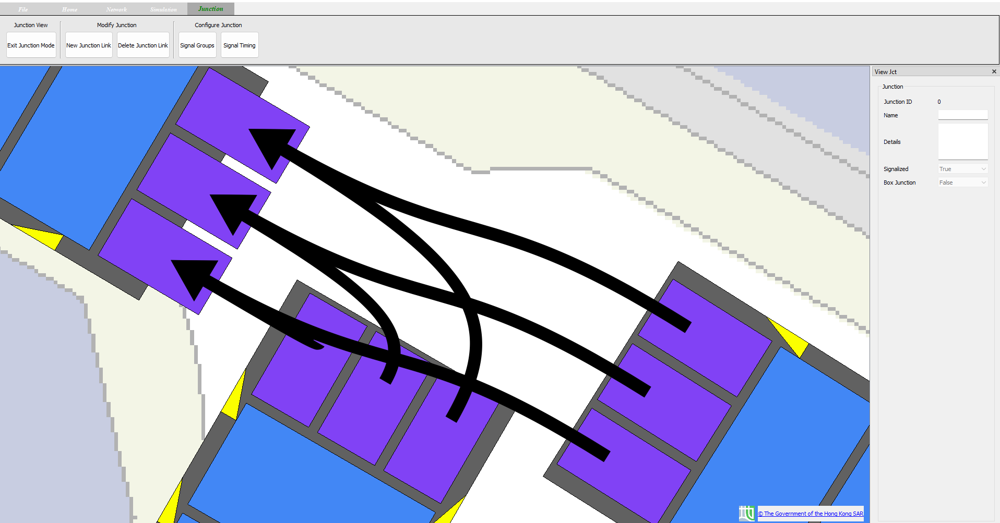
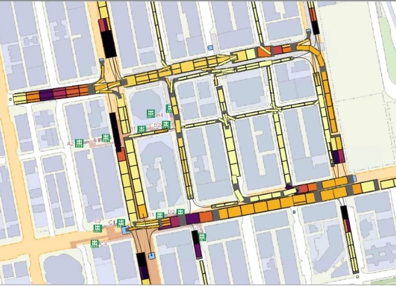

# GUI of a traffic Cell-based traffic messo simulation model 
It’s desktop GUI source code of a traffic simulation model which includes Cell-based traffic messo simulation and genetic algorithm optimization. It is created by Qt frameworks.

## File Page
 

## Junction Page
 

## Adaptive Traffic Control System Juntions
 

## General porpose
This project is a prototype for general traffic scenarios, scale up applications to network-wide junctions by decentralisation algorithms. Its a desktop software platform to an actual traffic signal controller used in Hong Kong for validation.

